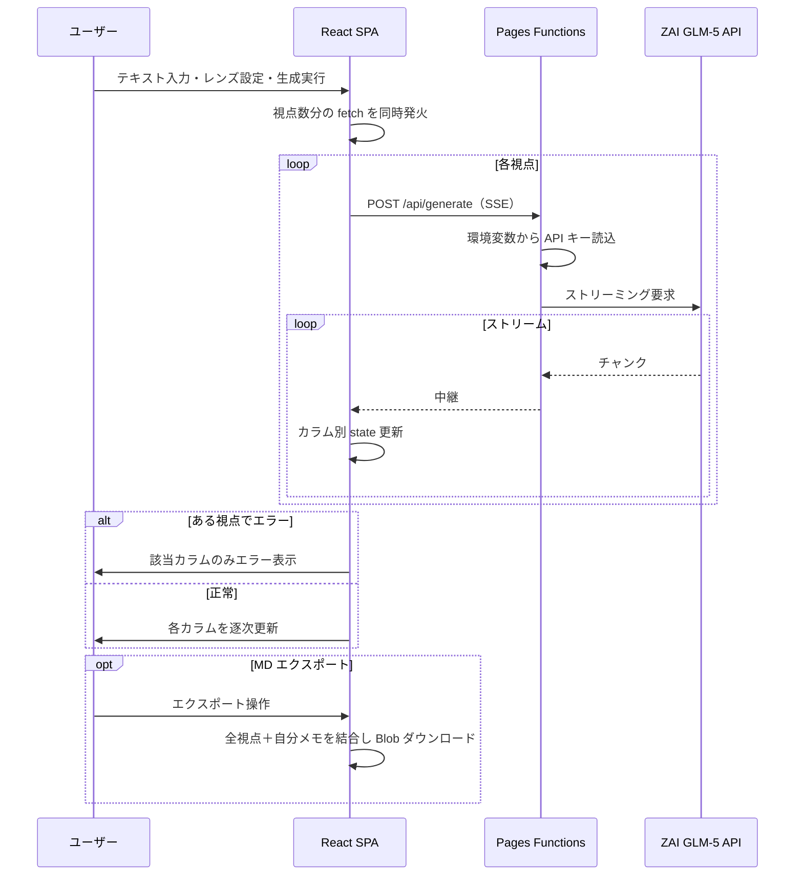

# 多視点メモ — 技術スタック フロー（シーケンス）

`TECH_STACK.md` の全体構成・並列ストリーミング・MD エクスポートを表した図です。レンダリング用の生データは [`tech-stack-flow.mmd`](./tech-stack-flow.mmd) にあります。

```mermaid
sequenceDiagram
    participant U as ユーザー
    participant B as React SPA
    participant F as Pages Functions
    participant G as ZAI GLM-5 API

    U ->> B: テキスト入力・レンズ設定・生成実行
    B ->> B: 視点数分の fetch を同時発火
    loop 各視点
        B ->> F: POST /api/generate（SSE）
        F ->> F: 環境変数から API キー読込
        F ->> G: ストリーミング要求
        loop ストリーム
            G -->> F: チャンク
            F -->> B: 中継
            B ->> B: カラム別 state 更新
        end
    end
    alt ある視点でエラー
        B ->> U: 該当カラムのみエラー表示
    else 正常
        B ->> U: 各カラムを逐次更新
    end
    opt MD エクスポート
        U ->> B: エクスポート操作
        B ->> B: 全視点＋自分メモを結合し Blob ダウンロード
    end
```
